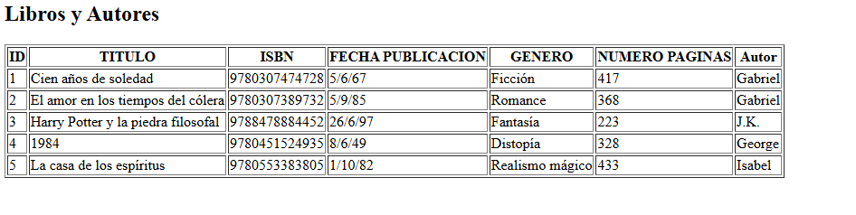

# 📚 ApacheStrutsBiblioteca

Este es un proyecto web en Java usando **Apache Struts 2**, **JSP** y **MySQL** para gestionar y mostrar una lista de libros con sus respectivos autores. Está configurado para correr en **Apache Tomcat 9** y probado con **JDK 17**.

---

## 🚀 Tecnologías

- Java 17
- Apache Struts 2
- JSP / JSTL
- MySQL 8+
- Apache Tomcat 9 (smart tomcast)
- Apache Commons DBCP2
- Maven

---

## 🗃️ Ejecución del proyecto

En la consola, ejecutar el siguiente comando siempre antes de lanzar el server de Tomcast: 

```
mvn clean package
```

Ahora, para configurar el Tomcast en IntelIj Idea Comunity Edition y poder lanzar la app, hay que hacer: 

- Edit Configurations > Pinchar en + > Agregar Smart Tomcast
- Deployment directory: target/ApacheStrutsBiblioteca
- Use classpath o module: ApacheStrutsBiblioteca
- Apply y run.

---

## 📸 Captura del proyecto



